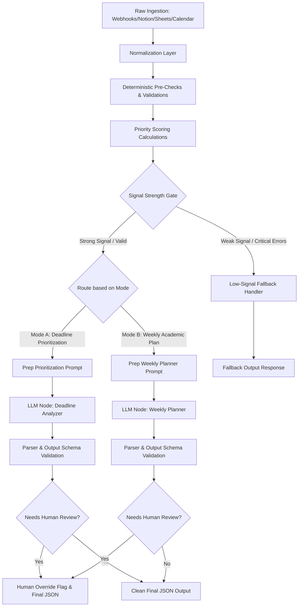

# Architecture Overview

This document outlines the system architecture and data pipeline of the **Student Deadline Command Center Automation**. 

The system relies on a hybrid pipeline: combining **deterministic programmatic logic** (for validation, calculations, and signal-strength checks) with **generative reasoning logic** (for synthesis, contextual planning, and action item drafting). This guarantees that quantitative data (like due dates, calendar slots, and grade weights) remains accurate and is not modified by the AI.

---

## 1. High-Level Data Pipeline

The following flowchart represents how incoming academic data flows from initial ingestion to the final response output:

---

## 2. Ingestion & Normalization Layer

The workflow accepts inputs from multiple channels. Since every input system formats data differently, the **Normalization Node** standardizes the fields before running logic.

### Normalized Item Schema
Every input event is mapped to this uniform internal structure:
*   `title` (string): Standardized name of task/milestone.
*   `course_name` (string): Normalized course code or department title.
*   `deadline_type` (string): Allowed values: `assignment`, `exam`, `quiz`, `admin`, `reading`, `project_milestone`, `application_deadline`, `fee_payment`.
*   `due_date` (ISO-8601 string): Absolute UTC timestamp.
*   `estimated_hours` (float): Projected completion time.
*   `weight_percent` (float): Contribution percentage to course grade (0-100).
*   `importance_level` (string): Allowed values: `high`, `medium`, `low`.
*   `source` (string): Origin of data (e.g., `canvas_api`, `google_forms`, `notion_db`).
*   `status` (string): Allowed values: `not_started`, `in_progress`, `completed`.
*   `notes` (string): Additional context or instructions.

---

## 3. Deterministic Pre-Checks

Before the payload reaches the LLM, the automation runs a series of non-AI, code-level checks (using JavaScript inside n8n Code nodes). This filters out bad data and flags high-risk issues programmatically:

1.  **Missing Critical Fields:** Checks for missing `due_date` or `title`. If found, these are either populated with a warning code or directed to the low-signal handler.
2.  **Date Validation:** Identifies bad date formatting or dates set in the past.
3.  **Overdue Detection:** Flags items where `due_date` < `current_time` and `status` != `completed`.
4.  **Negative/Impossible Work Estimates:** Checks if `estimated_hours` is negative or unreasonably high (e.g., estimating 80 hours for a single-day assignment).
5.  **Duplicate Detection:** Matches titles and courses within a 24-hour window to remove duplicate LMS scrapes.
6.  **Calendar Conflict Analysis:** Programmatically flags when a due date directly overlaps with a busy calendar slot.

---

## 4. Priority Scoring Algorithm

The priority score is computed programmatically to prevent the AI from shifting deadlines arbitrarily. The score ($P$) is calculated on a scale of `0` to `100` using the following factors:

$$P = (W_{time} \times S_{time}) + (W_{weight} \times S_{weight}) + (W_{effort} \times S_{effort}) + S_{overdue} + S_{competing}$$

Where:
*   **Time Urgency ($S_{time}$):** Exponential decay based on days remaining.
    *   $\le 1$ day: 100 points
    *   $\le 3$ days: 80 points
    *   $\le 7$ days: 50 points
    *   $\le 14$ days: 20 points
    *   $> 14$ days: 0 points
*   **Grade Weight ($S_{weight}$):** Based on the weight percentage ($W\%$).
    *   $W\% \ge 20\%$: 100 points
    *   $10\% \le W\% < 20\%$: 70 points
    *   $W\% < 10\%$: 30 points
*   **Effort Score ($S_{effort}$):** Determined by estimated completion hours ($H_{est}$).
    *   $H_{est} \ge 10$ hours: 100 points
    *   $4 \le H_{est} < 10$ hours: 70 points
    *   $H_{est} < 4$ hours: 30 points
*   **Overdue Boost ($S_{overdue}$):** Add 25 points if the task is overdue.
*   **Competing Deadline Penalty ($S_{competing}$):** Add 15 points if 3 or more deadlines fall on the same date.

**Weight distribution in final formula:**
*   $W_{time} = 0.50$ (50% of base score)
*   $W_{weight} = 0.30$ (30% of base score)
*   $W_{effort} = 0.20$ (20% of base score)

The maximum possible calculated score is capped at `100`. Items with scores $\ge 80$ are marked as **Critical**, $50-79$ as **Important**, and $< 50$ as **Routine**.

---

## 5. AI Reasoning & Synthesis Layer

The LLM receives the normalized, validated list of deadlines along with their calculated priority scores. The AI's job is not to calculate math, but to formulate plans.

### Mode A: Deadline Prioritization Analysis
*   Interprets the priority scoring in human terms.
*   Generates a step-by-step action plan for the next 72 hours.
*   Assigns a reminder cadence (e.g., daily ping vs. weekly summary).
*   Determines whether the task should be actively worked on immediately ("Start Now"), scheduled for later ("Schedule"), or simply tracked ("Monitor").

### Mode B: Weekly Academic Planning
*   Synthesizes the weekly schedule, mapping out focus areas.
*   Schedules concrete study blocks (matching the student's preferred length, e.g., 90 minutes) across the week.
*   Identifies scheduling gaps where study requirements exceed the student's availability (`weekly_available_study_hours`).
*   Suggests non-critical tasks to defer.

---

## 6. Fallback & Validation Behavior

To ensure a failure in the LLM or a poorly structured input does not crash the system, the workflow contains validation barriers:

*   **Signal Gate:** If an intake request has less than 2 valid fields or contains no dates, it is routed away from the AI to a low-latency **Low-Signal Fallback Node**, which returns a pre-formatted JSON response explaining what information was missing.
*   **JSON Schema Validation:** After the AI executes, a validation script checks the output structure. If fields are missing or the output is malformed, a fallback parser cleans the string, or routes it to a human-review flag node to ensure no bad data passes.
*   **Safety Guards:** System instructions forbid the AI from diagnosing attention issues, shaming, or using therapist-style language.
